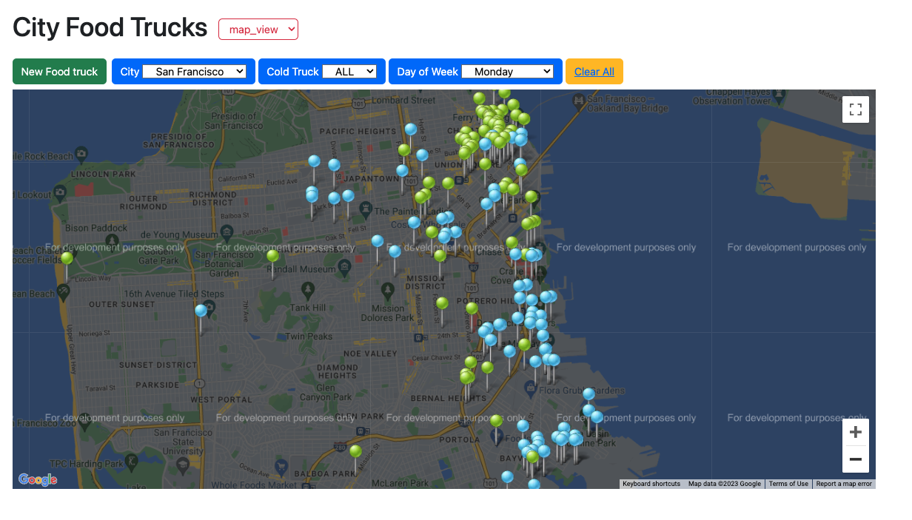
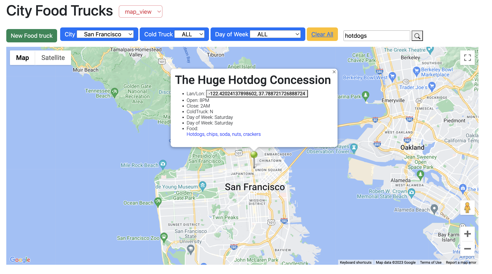
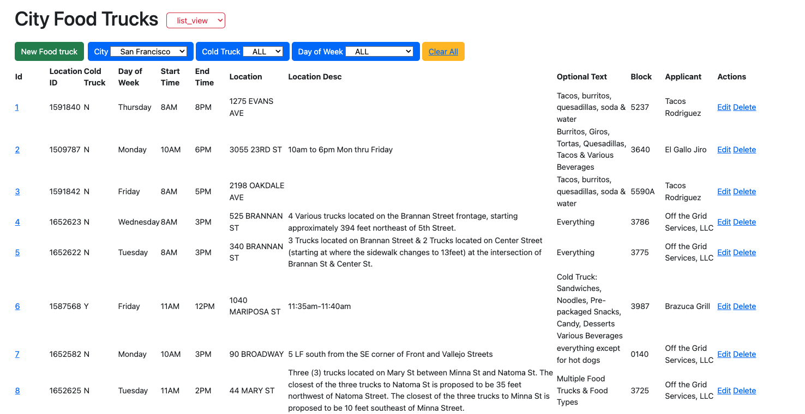

# Cityfood
This app is build to show food-trucks information in SF area.  It is built using Phoenix LiveView. 

  
  
  

  

## Preoject Scope & Features
- DB is using postgress
- Imported data original from [json-api-data](https://data.sfgov.org/resource/jjew-r69b.json), which is initalized by [DB seed](./priv/repo/seeds.exs). This can also be refreshed by manually calling `DataFetcher.refresh_data()`.
- [Home page](http://localhost:4001/) is the list view of all food-trucks. 
  - filters: cities, cold-truck or not, day-of-week
  - clear all
  - `map view`

- Other genernic operations, view/edit/delete of cities & food-trucks. 

## Setup 

### 1. To setup google map api key

- Make sure you have this in `config.exs` 
  ```
  config :cityfood, :google_map, api_key: System.get_env("GOOGLE_MAP_API_KEY")
  ```
- Save you google-map-api key in this env variable: `GOOGLE_MAP_API_KEY`

### 2. Install Bootstrap

We need to install Bootstrap and its sole peer-dependency Popper inside the assets folder.
  ```
  cd assets
  npm init -y 
  npm i bootstrap @popperjs/core 
  ```
  
### To start your Phoenix server:

  * Install dependencies with `mix deps.get`
  * Create and migrate your database with `mix ecto.setup`
  * Start Phoenix endpoint with `mix phx.server` or inside IEx with `iex -S mix phx.server`

Now you can visit [`localhost:4001`](http://localhost:4001) from your browser.

Ready to run in production? Please [check our deployment guides](https://hexdocs.pm/phoenix/deployment.html).

## Learn more

  * Official website: https://www.phoenixframework.org/
  * Guides: https://hexdocs.pm/phoenix/overview.html
  * Docs: https://hexdocs.pm/phoenix
  * Forum: https://elixirforum.com/c/phoenix-forum
  * Source: https://github.com/phoenixframework/phoenix
